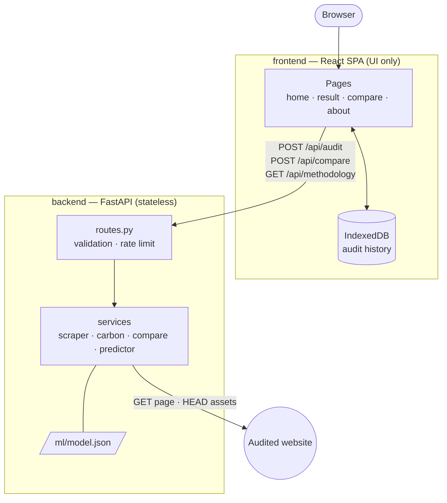
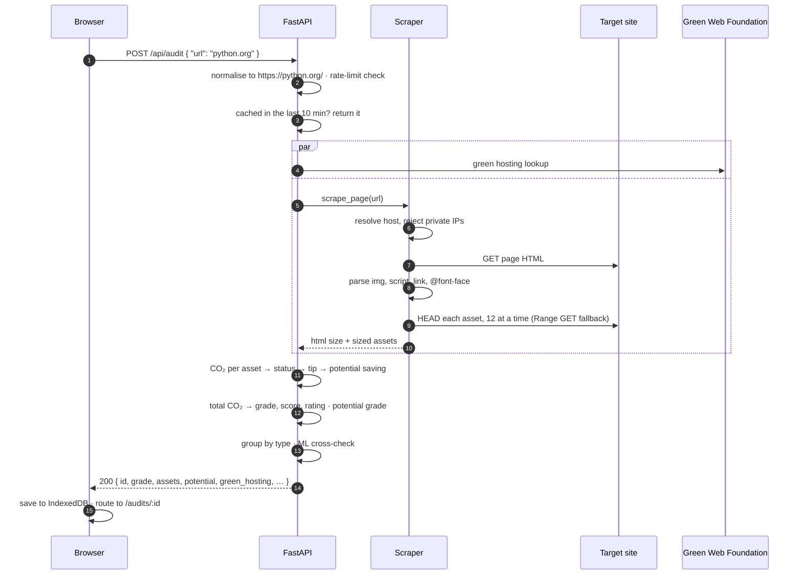

# EcoWeb Auditor

A web application that estimates the carbon footprint of any web page **element by
element**, using the Sustainable Web Design (SWD) model, and cross-checks every result
with an independently trained regression model.

---

## Table of contents

- [The problem](#the-problem)
- [Features](#features)
- [Architecture](#architecture)
- [Audit pipeline](#audit-pipeline)
- [Tech stack](#tech-stack)
- [Getting started](#getting-started)
- [Configuration](#configuration)
- [API reference](#api-reference)
- [The carbon model](#the-carbon-model)
- [Verification](#verification)
- [Implementation notes](#implementation-notes)
- [Project structure](#project-structure)
- [Known limitations](#known-limitations)
- [References](#references)
- [License](#license)

---

## The problem

Information and communications technology accounts for roughly **3.7%** of global
greenhouse gas emissions, which is comparable to aviation. Every byte a page transfers
consumes energy in the data centre, across the network and on the visitor's device.

Existing calculators such as WebsiteCarbon.com return a single grade for a whole page.
That grade can't be acted on: a developer learns the page is heavy, but not **which image,
script, stylesheet or font** is responsible, or what to do about it.

EcoWeb Auditor prices each asset separately:

1. Fetch the page and discover every asset it references
2. Measure each asset's transfer size
3. Convert bytes to CO₂ with the SWD formula, per asset and in total
4. Grade the page, rank the assets, and attach a concrete fix to each one

Primary research (n = 31 IT and software engineering professionals and students) found
that **90.3%** would use a tool with this element-level breakdown.

---

## Features

- **Element-level breakdown.** Every image, script, stylesheet and font is priced in CO₂,
  ranked, and given a concrete fix.
- **Potential savings.** Shows how much each fix would save and the grade the page would
  reach once the flagged assets are fixed.
- **Green hosting check.** Shows whether the site's host runs on renewable energy, via The
  Green Web Foundation.
- **ML cross-check.** An independently trained regression model verifies the SWD figure.
- **History, re-audit and trends.** Audits are saved in your browser. Run one again with a
  click, and see a CO₂ trend line once a site has been audited more than once.
- **Compare.** Put two audits side by side, with per-metric and per-asset-type changes.
- **Export.** Save a report as PDF (print-friendly layout) or JSON, and export or import your
  whole history to move it between devices.
- **Installable and offline.** Install it as an app on phone or desktop. Saved audits open
  without a connection.

---

## Architecture



The split is strict. **All validation, calculation and comparison happen in the
backend.** The frontend renders results and keeps history, and nothing else.

The backend is **stateless** and has no database. Each visitor's audit history lives in
their own browser (IndexedDB), so it is private by construction: no visitor can see
another visitor's audits, and the server stores nothing.

---

## Audit pipeline



Every request the scraper makes, including each redirect hop and each asset request,
passes through the same private-address guard.

---

## Tech stack

| Layer | Choice | Notes |
|---|---|---|
| API | FastAPI + Pydantic v2 | Request/response contracts double as the OpenAPI schema |
| Scraping | httpx (async) + BeautifulSoup | Built-in `html.parser`, so there's no native dependency |
| ML inference | Plain Python | Model exported to JSON; no scikit-learn or NumPy at runtime |
| Frontend | React 19 + TypeScript 5.9 | `strict` enabled |
| Build | Vite 8 | Route-level code splitting |
| Routing | React Router 8 | `/`, `/audits/:id`, `/compare/:a/:b`, `/about` |
| Charts | Chart.js 4 | Tree-shaken, only the controllers that are used |
| History | IndexedDB via `idb-keyval` | About 600 bytes |
| API types | `openapi-typescript` | Generated from the backend schema |
| Offline | `vite-plugin-pwa` (Workbox) | Generated service worker and web app manifest |

The backend runs on **Python 3.12–3.14** with six direct dependencies.

---

## Getting started

### Prerequisites

- Python 3.12 or newer
- Node.js 20.19+ or 22.12+

### 1. Start the backend

```bash
cd backend
python -m venv venv
venv\Scripts\activate
python -m pip install -r requirements.txt
uvicorn main:app --reload --port 8000
```

On macOS or Linux, activate the venv with `source venv/bin/activate`.

Verify:

```bash
curl http://localhost:8000/health
```

```json
{"status":"healthy","service":"ecoweb-auditor"}
```

### 2. Start the frontend

In a second terminal:

```bash
cd frontend
npm install
npm run dev
```

Open **http://localhost:5173**. The Vite dev server proxies `/api` to port 8000, so no
CORS or environment setup is needed. It also listens on the local network: open the
printed `Network` address on a phone to test on a real device.

### Scripts

| Command | Where | Description |
|---|---|---|
| `python -m unittest discover tests` | `backend/` | Run the backend unit tests |
| `npm run dev` | `frontend/` | Dev server with hot reload |
| `npm run build` | `frontend/` | Type-check, then build the production bundle into `dist/` |
| `npm run preview` | `frontend/` | Serve the production bundle, still proxied to the local backend. The service worker only runs here and in production, not in `npm run dev` |
| `npm run types` | `frontend/` | Regenerate `src/api-types.ts` from the running backend |

---

## Configuration

There are **no `.env` files**. Every setting has a working default in
`backend/app/config.py`; to override one, set an environment variable with the same name
before starting the backend.

```bash
# Windows PowerShell
$env:ALLOW_PRIVATE_URLS = "true"
```

```bash
# macOS / Linux
export ALLOW_PRIVATE_URLS=true
```

| Key | Default | Purpose |
|---|---|---|
| `ALLOWED_ORIGINS` | the deployed frontend | Comma-separated CORS origins. Not needed locally, because Vite proxies |
| `ALLOW_PRIVATE_URLS` | `false` | Permit auditing localhost and private-network sites |
| `AUDITS_PER_MINUTE` | `10` | Audits allowed per client IP per minute |
| `SCRAPER_TIMEOUT` | `30` | Seconds to wait for the audited page |
| `MAX_ASSETS_PER_PAGE` | `80` | Upper bound on assets sized per audit |

The frontend needs no configuration. It calls relative `/api` URLs when served from
`localhost` and the deployed API everywhere else.

---

## API reference

Interactive documentation is served at **http://localhost:8000/docs**.

### `POST /api/audit`

Audits a page. The scheme is optional, so `python.org` becomes `https://python.org/`.

```json
{ "url": "example.com", "refresh": false }
```

A URL audited in the last 10 minutes is answered from a short-lived cache with the same
`id` and `audited_at`. Send `"refresh": true` to force a new scan.

Responds `200 OK` (arrays shortened):

```json
{
  "id": "1dc99a8a-40f8-4d0d-a70d-d6ce3aa3f3f9",
  "url": "https://example.com/",
  "audited_at": "2026-09-29T20:11:25.907383Z",
  "grade": "A+",
  "score": 96,
  "rating": "Sustainable",
  "total_co2": 0.001,
  "annual_co2_kg": 0.123,
  "trees_to_offset": 0.0,
  "total_bytes": 2866,
  "page_weight_mb": 0.0,
  "request_count": 1,
  "comparison": "Less than 1 metre driven in a petrol car per page load",
  "categories": [
    { "name": "Script", "count": 1, "total_bytes": 2153, "total_co2": 0.0008, "percentage": 75.1 }
  ],
  "assets": [
    {
      "name": "s.js",
      "url": "https://example.com/s.js",
      "asset_type": "script",
      "size_bytes": 2153,
      "co2_grams": 0.000771,
      "saving_co2_grams": 0.0,
      "status": "green",
      "optimization_tip": "Script is well-sized. Ensure it is deferred if non-critical and served with Brotli compression for best transfer efficiency."
    }
  ],
  "ml_prediction": {
    "predicted_co2_grams": 0.001027,
    "model_name": "Linear Regression",
    "r2_score": 0.9964,
    "difference_pct": 0.1,
    "agreement": "close"
  },
  "potential": { "total_co2": 0.001, "grade": "A+", "score": 96, "saving_pct": 0.0 },
  "green_hosting": { "green": true, "hosted_by": "Cloudflare" }
}
```

Assets are sorted by CO₂, heaviest first. `status` is `green`, `amber` or `red` against
per-type size thresholds. `agreement` is `close` when the ML estimate lands within ±15%
of the SWD figure, and `divergent` otherwise.

`saving_co2_grams` estimates what fixing an asset would save, and `potential` is the page
after every flagged asset is fixed (see [Potential savings](#potential-savings)).
`green_hosting` comes from The Green Web Foundation and is `null` when the lookup fails. It
is informational only and never changes the grade.

The server does not store the result. The frontend saves it to IndexedDB and the `id`
becomes the `/audits/:id` route.

| Status | When |
|---|---|
| `422` | Invalid URL, unreachable site, HTTP error from the site, or a private address |
| `429` | Rate limit exceeded. Carries a `Retry-After: 60` header |

Every error body is a single readable string: `{ "detail": "..." }`.

### `POST /api/compare`

Compares two audit results taken from the browser's history.

```
{ "a": <audit result>, "b": <audit result> }
```

The request can arrive in either order, because the server orders the two audits by
`audited_at`. It returns the older and newer summaries, a verdict and summary sentence,
and one row per metric and per asset category:

```json
{
  "verdict": "worse",
  "summary": "Audit B emits 14120% more CO₂ per visit than Audit A.",
  "metrics": [
    { "key": "score", "label": "Score", "older": 96, "newer": 88, "change_pct": -8, "direction": "down", "verdict": "worse" },
    { "key": "total_co2", "label": "CO₂ per visit", "older": 0.001, "newer": 0.1422, "change_pct": 14120, "direction": "up", "verdict": "worse" }
  ],
  "categories": [ "..." ]
}
```

`change_pct` is `null` when the older value is zero, meaning there is no baseline to
compare against.

### `GET /api/methodology`

Returns the SWD constants, the grade and rating thresholds, the asset-status thresholds,
the savings rates and the ML model's evaluation metrics, read straight from the code. The About page renders
its formula and grade scale from this endpoint, so the documentation can't drift from
the implementation.

### `GET /health`

Liveness check.

---

## The carbon model

```
CO₂ (g) = (bytes ÷ 10⁹) × 0.81 kWh/GB × 442 gCO₂/kWh
```

| Constant | Value | Meaning |
|---|---|---|
| Energy intensity | 0.81 kWh/GB | Energy to transfer one gigabyte across the internet |
| Carbon intensity | 442 gCO₂/kWh | Global average grid intensity (2023) |

The formula is applied to every asset individually and to the page total. The page total
maps to a grade:

| Grade | CO₂ per visit | Score | Rating |
|---|---|---|---|
| A+ | < 0.095 g | 96 | Sustainable |
| A | 0.095 – 0.184 g | 88 | Sustainable |
| B+ | 0.184 – 0.338 g | 78 | Needs Work |
| B | 0.338 – 0.493 g | 65 | Needs Work |
| C | 0.493 – 0.656 g | 50 | High Impact |
| D | 0.656 – 0.857 g | 35 | High Impact |
| F | > 0.857 g | 10 | High Impact |

Annual figures assume 10,000 visits a month. The real-world comparison uses a petrol car
at 150 gCO₂/km, and the tree offset assumes 21 kg of CO₂ absorbed per tree per year.

### Potential savings

Every amber or red asset is given an estimated reduction, matching the fix its tip
recommends. The page's potential grade is the SWD grade after all of those reductions.

| Asset | Amber | Red | Based on |
|---|---|---|---|
| Image | 70% | 70% | WebP or AVIF conversion |
| Script | 30% | 50% | Minification, tree-shaking and code-splitting |
| CSS | 50% | 80% | Removing unused rules |
| Font | 50% | 70% | Subsetting and WOFF2 |
| Media | 30% | 40% | Modern codecs |

Well-sized (green) assets are assumed to have nothing left to save.

### ML cross-validation

A linear regression model, trained on 63 real audits with 24 element-level features
(asset counts, sizes, averages, maxima, status counts and weight shares), independently
predicts the page's CO₂.

| Metric | Value |
|---|---|
| R² | 0.9964 |
| MAE | 0.0105 g |
| RMSE | 0.0378 g |

The SWD figure stays authoritative for the grade. The model exists to show that the
element-level features explain the result.

---

## Verification

Sample output below is taken from real runs against a local backend.

### Unit tests

```bash
cd backend
python -m unittest discover tests
```

```
Ran 16 tests in 0.228s

OK
```

The tests cover:
- URL normalisation
- The private-address guard, including IPv4-mapped IPv6
- HTML asset extraction (srcset, preloads, icons, inline font URLs, deduplication)
- Grade and rating boundaries
- Compare ordering and verdicts
- ML model parity with the original scikit-learn predictions
- A full audit pipeline run validated against the response schema, including savings and
  the potential grade
- The green hosting lookup, including failure returning "unknown"
- The audit cache, and `refresh` bypassing it

### A real audit

```bash
curl -X POST http://localhost:8000/api/audit -H "Content-Type: application/json" -d '{"url":"python.org"}'
```

```
url            https://python.org/
grade          A  (score 88, Sustainable)
total_co2      0.1422 g per visit
page weight    0.38 MB across 15 requests
categories     Css 39.9% · Script 38.4% · Image 8.4%
ml_prediction  0.142191 g  (difference 0.0%, agreement: close)
potential      0.0953 g, still grade A (32.9% of the page weight is savable)
green_hosting  not verified green
```

### Private addresses are refused

```bash
curl -X POST http://localhost:8000/api/audit -H "Content-Type: application/json" -d '{"url":"169.254.169.254"}'
```

Responses for `127.0.0.1`, `localhost:8000`, `169.254.169.254` and `ftp://example.com`:

```
422  {"detail":"127.0.0.1 points to a private or reserved address and can't be audited."}
422  {"detail":"localhost points to a private or reserved address and can't be audited."}
422  {"detail":"169.254.169.254 points to a private or reserved address and can't be audited."}
422  {"detail":"url: URL scheme should be 'http' or 'https'"}
```

### Rate limiting

After the tenth audit within a minute from one IP:

```
HTTP/1.1 429 Too Many Requests
retry-after: 60
{"detail":"Too many audits from your network. Please wait a minute and try again."}
```

### Frontend

Checked at 375 px, 768 px and 1280 px in both themes:
- Auditing a site, reopening it from history, and refreshing on `/audits/:id`
- The savings card, per-asset savings and the green hosting pill
- "Run again" forcing a fresh scan, and the trend line appearing for the second audit
- Downloading JSON, and exporting, clearing and re-importing history (re-imports don't
  duplicate, and files older than 7 days or the wrong shape are rejected clearly)
- Opening audits saved before these features existed
- With the production bundle (`npm run preview`): the service worker registers and
  precaches the app, and after stopping both servers a saved audit still opens with its
  charts, the About page loads, and a new audit shows the offline message
- Comparing two audits and the About page
- Empty and error states

All pages were free of horizontal overflow and console errors, and `npm run build` is
clean under `strict` TypeScript.

---

## Implementation notes

### Server-side request forgery guard

An auditing tool fetches whatever URL it is given, and a naive one will happily fetch
`http://169.254.169.254/` (cloud metadata) or `http://localhost:6379/`. Every outgoing
request goes through an httpx `request` event hook. The hook resolves the host, unwraps
IPv4-mapped IPv6 addresses, and rejects anything not globally routable.

Because the hook fires on every request, **redirect hops are re-checked too**, so a public
URL that redirects to an internal address is refused mid-chain. An asset that resolves
privately is silently skipped rather than failing the whole audit.

### Rate limiting without a dependency

Audits are limited per client IP with a sliding one-minute window held in memory. The
client IP comes from the first `X-Forwarded-For` entry set by the hosting proxy. Stale
entries are swept once more than 1,000 IPs are tracked, so memory stays bounded.

### Short-lived audit cache

Results are cached in memory per URL for 10 minutes, capped at 100 entries with the oldest
evicted first. Repeat audits return instantly and audited sites aren't scanned again for
nothing. The cached result keeps its original `id` and `audited_at`, so it is honest about
when the scan ran.

### Green hosting lookup

The audited hostname is sent to The Green Web Foundation's public greencheck API while the
page is being scraped, so the lookup adds no time. It has its own 5-second timeout and any
failure is reported as unknown rather than failing the audit.

### ML model as JSON

The model was trained with scikit-learn (`StandardScaler` + `LinearRegression`), which
pulls in scikit-learn, NumPy, SciPy and joblib, over 100 MB, just to evaluate one dot
product. The fitted coefficients, intercept, scaler means and scales, and feature order
were exported to a 2 KB `model.json`. A prediction is now:

```
Σ coef · (x − mean) / scale + intercept
```

in plain Python. Predictions match the original model exactly on real audits (a unit test
pins this), and backend memory fell from **177 MB to 81 MB**.

### Readable validation

Pydantic's structured error arrays are replaced by a single sentence, such as
`url: URL scheme should be 'http' or 'https'`, so the frontend can show `detail` as-is.

### Memory-efficient history

IndexedDB holds a small **index** (id, url, grade, CO₂, date) under one key, and each full
report under its own key. The history list only ever reads the index, and a full report is
loaded only when it is opened. On every write, entries are sorted by date, de-duplicated by
`id`, and those older than seven days or beyond fifty are pruned along with their reports.

Saving, re-auditing and importing all go through the same code path, so a cached re-audit or
a re-imported file never creates duplicate rows. An imported file is checked for the fields
a report needs before anything is written.

### Contract-first frontend

`src/api-types.ts` is generated from FastAPI's OpenAPI schema. If a response field is
renamed in the backend, regenerating the types makes the TypeScript build fail, instead of
the UI silently rendering `undefined`.

### Built for every device

- Route-level code splitting keeps Chart.js out of the first download
- Touch targets are at least 44 px on coarse pointers
- Safe-area insets are respected on notched phones
- Inputs are 16 px, so iOS doesn't zoom in on focus
- `prefers-reduced-motion` disables animation
- The first-visit theme follows `prefers-color-scheme`
- Charts are destroyed when their view unmounts and redrawn when the theme changes

### Installable and offline

`vite-plugin-pwa` generates the web app manifest and a Workbox service worker at build time.
The service worker precaches the app shell and every route's chunk, about 540 KB, after the
first page has loaded, so it never slows the first render. Navigations fall back to the
cached `index.html`, which lets saved audits open offline straight from IndexedDB. API
calls are never cached.

Updates install automatically on the next visit, and outdated caches are cleaned up. The
icons, including a full-bleed maskable icon for Android and a touch icon for iOS, were
generated once from `favicon.svg` and are committed as static files.

---

## Project structure

```
backend/
├── main.py                  app setup, CORS, validation-error handler
├── requirements.txt
├── app/
│   ├── config.py            settings with local defaults
│   ├── schemas.py           request and response models
│   ├── routes.py            /api endpoints + rate limit
│   ├── ml/model.json        exported regression model
│   └── services/
│       ├── audit.py         pipeline: scrape → price → group → cross-check
│       ├── scraper.py       async fetcher + private-address guard
│       ├── carbon.py        SWD maths, grades, ratings, tips, methodology
│       ├── compare.py       ordering, % change, verdicts, summary
│       └── predictor.py     feature builder + JSON linear model
└── tests/test_logic.py      stdlib unittest suite

frontend/
├── index.html               shell + pre-paint theme script
├── vite.config.ts           dev/preview proxy, PWA manifest and service worker
├── vercel.json              build settings, SPA rewrite, legacy redirects
├── public/                  favicon and app icons
└── src/
    ├── main.tsx             router with lazy-loaded routes
    ├── App.tsx              layout, navigation, theme
    ├── api.ts               fetch wrapper for the three endpoints
    ├── api-types.ts         generated from OpenAPI
    ├── history.ts           IndexedDB history
    ├── format.ts            display formatting and colours
    ├── styles.css           design tokens, both themes, responsive rules
    ├── pages/               Home, AuditResult, Compare, About
    └── components/          Charts, HistoryList
```

---

## Known limitations

These are deliberate, and documented rather than hidden.

**Static parsing only.** The scraper does not execute JavaScript, so assets injected at
runtime are not counted. A headless browser would capture them, at a large cost in memory
and audit time.

**Assets are sized, not downloaded.** Sizes come from `Content-Length`, or `Content-Range`
on a one-byte range request. Servers that send neither are left out of the total.

**DNS rebinding.** The private-address guard resolves the host, and httpx resolves it
again when connecting. A malicious DNS server could change the answer in between. Pinning
the resolved IP in a custom transport would close the gap.

**Rate limit and cache are per process.** Both reset on restart, and a client can spoof the
first `X-Forwarded-For` entry. Moving them to Redis or the edge proxy would fix both.

**Savings are estimates.** Reductions use typical figures for each fix, not a re-encoding of
the actual file.

**History is per browser.** No accounts means no automatic sync, and clearing site data
removes the history. Export and import move it between devices by hand. That is the accepted
cost of storing nothing on the server.

**Simulated progress.** The loading steps advance on a timer rather than reporting real
scan progress. Server-Sent Events would make them truthful.

**Valid certificates required.** Sites with broken TLS fail rather than being fetched
insecurely.

---

## References

- Greenwood, T. (2021) *Sustainable Web Design.* A Book Apart.
- Sustainable Web Design Model (2023) https://sustainablewebdesign.org/
- Preist, C., Schien, D. & Blevis, E. (2016) *Understanding and Mitigating the Effects of
  Device and Infrastructure Design on the Carbon Footprint of Digital Services.* CHI 2016.
- Climate Impact Partners (2023) *The Carbon Footprint of the Internet.*

---

## License

Released under the [MIT License](LICENSE). Copyright (c) 2026 Francis Remoshan.

---

<p align="center"><sub>Built as a BSc (Hons) Software Engineering final year project at the University of Bedfordshire.</sub></p>
